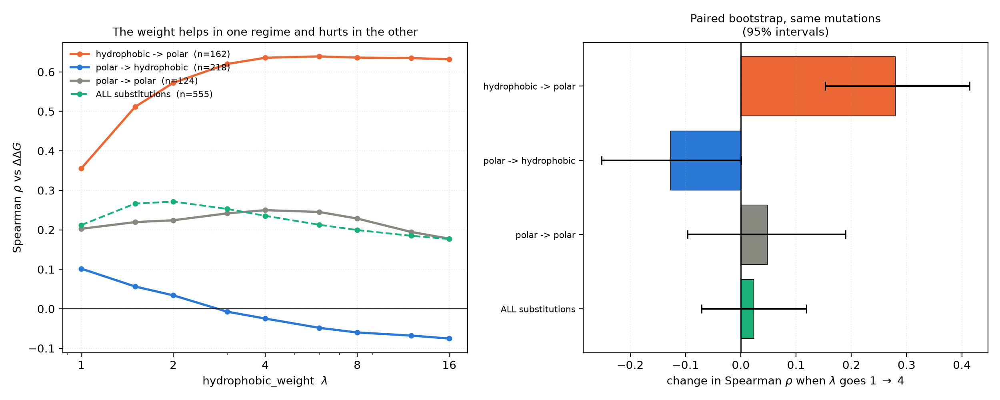

# Does `hydrophobic_weight` actually do anything?

**Short answer: yes, and the earlier conclusion that it does nothing was wrong. It was an artefact of
testing it only on X→Ala mutations, which cannot produce the case where the parameter matters.**

The weight helps a great deal when a mutation **removes** a hydrophobic contact, and hurts when one is
**introduced**. Over a mixed set the two effects largely cancel, leaving a net change that is not
distinguishable from zero (+0.023, 95% CI [−0.071, +0.119]), which is what the earlier test saw.

## Why the earlier test could not have found this

The alanine scan tested `hydrophobic_weight` on 1051 X→Ala mutations. But alanine is itself
moderately hydrophobic on the Kyte-Doolittle scale the term uses — after the term's rescaling onto
[0, 1], h(Ala) = 0.70, against 0.92 for leucine and 0.00 for arginine. So:

- mutating Leu→Ala barely changes h at that position (0.92 → 0.70);
- mutating Arg→Ala *raises* it (0.00 → 0.70).

Classifying those 1051 mutations gives **801 polar→hydrophobic and 250 hydrophobic→hydrophobic, and
not a single hydrophobic→polar case**. The one regime in which a hydrophobicity weighting should
matter is structurally absent from an alanine scan.

## Design of this test

555 non-alanine single interface substitutions from SKEMPI 2.0 in non-antibody complexes, each with
the side chain rebuilt and locally repacked (same pipeline as the
[non-alanine study](../repacked_nonalanine/summary.md)), classified by the hydrophobicity of the
wild-type and mutant residue on the term's own scale:

| class | definition | n |
|---|---|---|
| hydrophobic → polar | h(wt) ≥ 0.6, h(mut) < 0.45 | 162 |
| polar → hydrophobic | h(wt) < 0.45, h(mut) ≥ 0.6 | 218 |
| polar → polar | both < 0.45 | 124 |
| hydrophobic → hydrophobic | both ≥ 0.6 | 18 |
| unclassified / intermediate | h(wt) or h(mut) in [0.45, 0.6) | 33 |

The `[0.45, 0.6)` band is deliberately excluded from the four named classes, so the 33 intermediate
cases do not appear in any class-specific correlation; they are still counted in the pooled
`all substitutions` row (162 + 218 + 124 + 18 + 33 = 555).

Because φ = 1 + (λ−1)·h_a·h_b is linear in λ, the energy is exactly affine in λ. Two evaluations per
structure therefore reconstruct every λ exactly (verified numerically to 1e-9), which is what made a
continuous λ scan affordable.

An initial pass used a random sample of 50 hydrophobic→polar cases; because that produced the
headline result, **every remaining hydrophobic→polar and polar→hydrophobic substitution in the
dataset was then run** to confirm it rather than leaving it on a small sample.

## Result

Effect of raising `hydrophobic_weight` from 1 to 4, paired bootstrap on the same mutations:

| class | n | rho at λ=1 | rho at λ=4 | change | 95% CI | verdict |
|---|---|---|---|---|---|---|
| hydrophobic → polar | 162 | 0.356 | **0.636** | **+0.280** | [+0.153, +0.414] | **helps** |
| polar → hydrophobic | 218 | 0.102 | −0.025 | −0.127 | [−0.252, +0.001] | hurts |
| polar → polar | 124 | 0.203 | 0.250 | +0.048 | [−0.096, +0.189] | no effect |
| **all substitutions** | 555 | 0.212 | 0.236 | +0.023 | [−0.071, +0.119] | **no effect** |

The λ scan on hydrophobic→polar substitutions saturates quickly: 0.356 at λ=1, 0.572 at λ=2, 0.636 at
λ=4, and flat thereafter (0.639 at λ=6, 0.632 at λ=16). There is nothing to gain above about λ=4.

The `binary` scale shows the same direction but weaker and not significant (+0.090, 95% CI
[−0.019, +0.201]); Kyte-Doolittle is the better of the two choices for this purpose.

## Why the asymmetry

Removing a hydrophobic residue from an interface reliably costs binding energy, so up-weighting the
contact area it was burying amplifies a signal that is genuinely there. Introducing a hydrophobic
residue at a position that was polar does *not* reliably gain binding — it may clash, it may pay a
desolvation penalty, or it may break a hydrogen bond that was doing the work. A geometric term credits
the newly buried hydrophobic area regardless, so up-weighting it amplifies a signal that is often
false. Part of the gap will also be modelling noise: rebuilt side chains are subject to rotamer error
in a way that deletions are not.

## Consequences

1. **The default of 1.0 stands, but for a different reason than previously stated.** It is not that
   the parameter is inert; it is that its benefit and its harm are equal and opposite over a mixed
   mutation set, which is what a design run produces.
2. **Raise it to ~4 only for tasks that are specifically about not degrading an existing hydrophobic
   interface** — conservation, stability against erosion, or negative design against loss of a known
   hydrophobic hotspot.
3. **Do not raise it for de novo binder design**, where mutations introduce hydrophobic residues as
   often as they remove them and the parameter is actively harmful on that half.
4. The class-dependence is now recorded in the `hydrophobic_weight` docstring.

## A separate problem with the scale

Kyte-Doolittle is a membrane-propensity scale, not a burial-propensity scale, and it ranks two of the
most important interface hotspot residues as near-polar: after rescaling, h(Trp) = 0.40 and
h(Tyr) = 0.36, below h(Ala) = 0.70. For interface packing that is close to backwards. The `binary`
option uses `constants.hydrophobic_residues`, which includes Trp but omits Tyr, so it is not a fix
either. A burial-propensity scale (Fauchère-Pliška octanol transfer, or Rose fractional burial) would
be a better default for this application, and adding one is the obvious next change. That has not
been tested here.

## Caveats

- Class boundaries at h = 0.45 / 0.6 were chosen once, before the results were seen, but they are
  arbitrary; the effect is large enough that it should be robust to them, though this was not swept.
- The hydrophobic→hydrophobic class (n=18) is too small to report.
- Everything inherits the repacking limitation of the parent study: a restrained local minimisation,
  not a rotamer search.
- The substitution set is dominated by a handful of well-studied complexes, so effective sample size
  is smaller than n suggests.

## Files

- `results_per_mutation.csv` — 555 substitutions with ΔΔG, class, and the two energies needed to
  reconstruct any λ
- `lambda_effect_by_class.csv` — rho at λ=1 and λ=4 with paired bootstrap intervals per class
- `plots/hydrophobic_weight_by_substitution_class.png` — λ scan and the paired comparison
