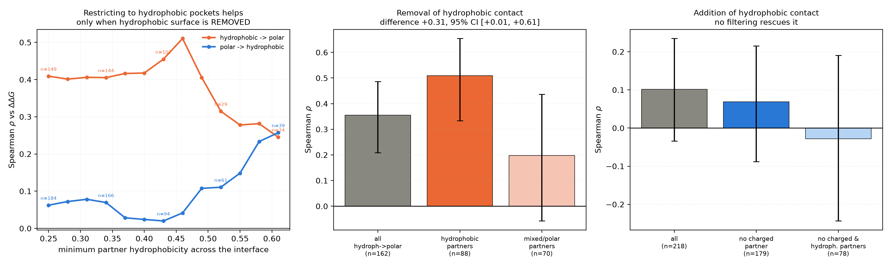

# Controlling for what the mutated residue is actually touching

The previous studies classified mutations by the identity of the mutated residue alone. That
conflates two different things: whether the mutation changes hydrophobic burial, and whether it also
tears up an ionic or hydrogen-bonding interaction. This study conditions on the **partner
environment** — what sits across the interface from the mutated residue — so the term is judged only
where hydrophobic contact is the dominant thing changing.

**Result: the hypothesis is confirmed for removal of hydrophobic contact and refuted for addition.**

- Removing a hydrophobic residue **from a hydrophobic pocket**: rho = **0.503** (λ=1) and **0.717**
  (λ=4), against 0.356 / 0.636 without the environment filter. The difference between hydrophobic
  and mixed/polar partner environments is **+0.310, 95% CI [+0.011, +0.608]** — significant.
- Adding a hydrophobic residue: **no filtering rescues it.** Removing every case with a charged
  partner and requiring hydrophobic partners moves rho from 0.102 to −0.028. The failure in this
  direction is *not* caused by ionic confounding.

## Environment descriptors

For each mutated residue, computed on the wild-type structure against the opposite chain group:

| descriptor | definition |
|---|---|
| `partner_h` | contact-weighted mean hydrophobicity (Kyte-Doolittle, rescaled to [0,1]) of the partner residues with any heavy atom within 5 Å |
| `n_charged_partners` | partner Asp/Glu/Lys/Arg whose charged atom group comes within 4.5 Å |
| `salt_bridge` | mutated residue is charged and an oppositely charged partner group is within 4.5 Å |
| `clean` | `n_charged_partners == 0` and no salt bridge |

Applied to both the 555 repacked substitutions and the 1051 alanine mutations (1606 total, 82 failed
to resolve and were dropped).

## Results

### Removing hydrophobic contact: the environment matters, as predicted

Sliding the minimum partner hydrophobicity upwards for hydrophobic→polar substitutions:

| partner_h ≥ | n | rho |
|---|---|---|
| 0.00 (all) | 158 | 0.365 |
| 0.35 | 141 | 0.407 |
| **0.45** | **88** | **0.510** |
| 0.55 | 26 | 0.278 |

The rise to 0.51 is real; the fall beyond 0.45 is small-sample noise (n drops to 26). Split at 0.45:

| partner environment | n | rho | 95% CI |
|---|---|---|---|
| hydrophobic (h ≥ 0.45) | 88 | **0.510** | [0.335, 0.649] |
| mixed / polar (h < 0.45) | 70 | 0.198 | [−0.064, 0.439] |
| **difference** | | **+0.310** | **[+0.011, +0.608]** |

**This is not a burial-depth confound.** The partner_h terciles have near-identical interface-location
composition (79–95% core in every tercile), and restricting to core positions only preserves the
effect: rho = 0.472 for hydrophobic partners against 0.309 for mixed/polar.

Combining both filters — hydrophobic partners *and* no ionic involvement — gives the best cell
anywhere in this work: **n = 87, rho = 0.503 at λ=1 and 0.717 at λ=4.**

The alanine scan agrees, with a progressive improvement as the environment is cleaned up:
all mutations 0.326 → hydrophobic→hydrophobic 0.362 → plus clean hydrophobic partners **0.406**
(n = 108).

### Adding hydrophobic contact: not confounded, just wrong

| subset | n | rho | 95% CI |
|---|---|---|---|
| all polar→hydrophobic | 218 | 0.102 | [−0.036, 0.237] |
| no charged partner | 179 | 0.069 | [−0.084, 0.215] |
| no charged partner and hydrophobic partners | 78 | −0.028 | [−0.247, 0.187] |
| core, clean, hydrophobic partners | 43 | 0.000 | [−0.305, 0.300] |

Every filter that should *improve* things leaves it at zero or slightly worse. So the asymmetry is
not an artefact of ionic interactions being torn up alongside the hydrophobic change.

Two observations suggest the reason is physical rather than methodological:

1. **Adding hydrophobic surface at an interface is destabilising on average**: mean ΔΔG for
   polar→hydrophobic substitutions is **+1.13 kcal/mol**. These positions sit in evolved interfaces,
   and inserting bulk usually costs strain, desolvation and displaced water more than the new
   hydrophobic contact returns. A geometric term sees more buried area and credits it — exactly
   backwards.
2. **It is not mechanical range compression.** ΔΔG spreads are comparable across classes
   (sd 2.39 for removals, 1.82 for additions), and the reported |ΔE| differs by only ~35%. Neither
   is enough to turn 0.51 into 0.00.

Rotamer error on rebuilt side chains certainly adds noise to the addition direction, and cannot be
separated from the physical explanation with the present repacking method.

## Consequences

1. **State the term's competence precisely:** it predicts the cost of *losing* hydrophobic packing in
   a hydrophobic pocket (rho ≈ 0.5, or ≈ 0.7 with `hydrophobic_weight=4`). It does not predict the
   benefit of *gaining* hydrophobic packing, in any environment tested.
2. **This is an asymmetry with a design consequence.** In a Monte Carlo run the term will resist
   erosion of an existing hydrophobic core — which is useful — but will over-credit proposals that
   bury new hydrophobic surface. Pairing it with a term that penalises exposed or newly buried
   hydrophobic surface elsewhere (`HydrophobicEnergy`, `SurfaceAreaEnergy`) is advisable.
3. The `hydrophobic_weight=4` benefit survives environment filtering and is largest in the cleanest
   cell (0.717), reinforcing the guidance in [`../hydrophobic_weight/`](../hydrophobic_weight/summary.md).

## Caveats

- Cell sizes are 40–160; intervals are wide and the key difference is significant but only just
  (lower bound +0.011).
- `partner_h` uses the same Kyte-Doolittle scale the term uses, which mis-ranks Trp and Tyr — so
  "hydrophobic partner" is defined by a scale known to be imperfect for burial.
- Thresholds (5 Å contact, 4.5 Å ionic, h = 0.45) were fixed once before looking at outcomes, but
  were not swept.
- Environment is computed on the wild-type structure only.

## Files

- `substitutions_with_environment.csv`, `alanine_with_environment.csv` — per-mutation energies plus
  the environment descriptors
- `environment_stratified_correlations.csv` — rho at λ=1 and λ=4 for every class × subset cell
- `plots/partner_environment.png` — sliding threshold and the two directional comparisons
