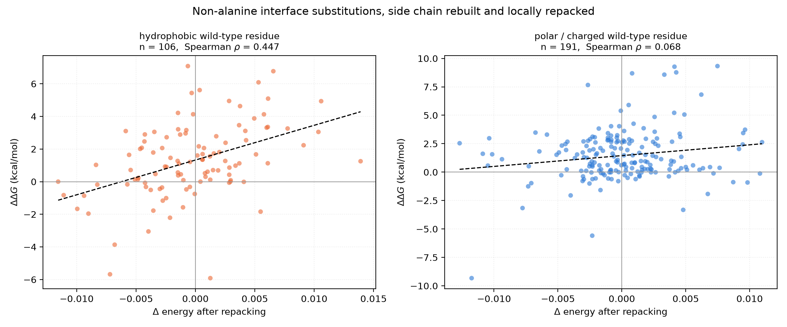
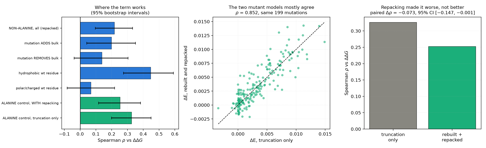

# Non-alanine substitutions with side chain rebuilding and repacking

This extends the [alanine scan](../summary.md) in the two directions its caveats called for: general
substitutions rather than deletions, and an explicit repacking step rather than truncation.

**Two findings, both of which correct what the alanine study assumed.**

1. **The term's usefulness is confined to hydrophobic interface positions.** On non-alanine
   substitutions it reaches rho = **0.45** where the wild-type residue is hydrophobic, and
   **0.07 — indistinguishable from zero** where it is polar or charged. In the alanine scan the same
   split was 0.38 against 0.21; with general substitutions the polar signal disappears entirely.

2. **Repacking made the correlation worse, not better.** On the same 199 alanine mutations, rebuilding
   and locally repacking the mutant gives rho = 0.253 against 0.326 for plain truncation, a paired
   difference of **−0.073, 95% CI [−0.147, −0.001]**. The alanine study predicted that its truncation
   numbers were "a lower bound on what the term could achieve with a repacking step". **That
   prediction was wrong**, at least for this repacking implementation.

## Method

- **Mutant model.** PDBFixer applies the substitution and rebuilds the missing side chain atoms;
  OpenMM (amber14 ff14SB, vacuum) then minimises a 15 Å pocket around the mutated site, with every
  atom outside a 6–8 Å free radius harmonically restrained to its crystallographic position.
  The pocket is cut out for the relaxation and its relaxed coordinates spliced back into the full
  complex, purely to keep the runtime tractable; the energy is always evaluated on the complete
  interface.
- **The wild type goes through the identical pipeline**, using an identity "mutation" at the same
  position, so the effect of the minimisation itself cancels in ΔE. This matters: without it the
  relaxation alone shifts the energy by more than most mutations do.
- **Selection, fixed before any energy was computed.** From the 1156 non-alanine single interface
  substitutions in non-antibody complexes (proline excluded on either side, since it changes the
  backbone), complexes above 5000 atoms were dropped and 150 mutations that increase side chain
  volume plus 150 that decrease it were sampled at random with a fixed seed. A further 200 alanine
  mutations already scored by truncation were sampled as a paired control. 496 of 500 jobs completed.

## Results

| subset                                | n   | Spearman rho | p       | CI low | CI high |
|---------------------------------------|-----|--------------|---------|--------|---------|
| NON-ALANINE, all (repacked)           | 297 | 0.217        | 0.00016 | 0.096  | 0.332   |
| non-alanine, mutation ADDS bulk       | 148 | 0.198        | 0.016   | 0.041  | 0.35    |
| non-alanine, mutation REMOVES bulk    | 149 | 0.138        | 0.094   | -0.039 | 0.303   |
| non-alanine, hydrophobic wt residue   | 106 | 0.447        | 1.6e-06 | 0.274  | 0.591   |
| non-alanine, polar/charged wt residue | 191 | 0.068        | 0.35    | -0.083 | 0.218   |
| non-alanine, delta Sc (intensive)     | 297 | 0.092        | 0.11    | -0.034 | 0.211   |
| non-alanine, -delta buried SASA       | 291 | 0.164        | 0.0051  | 0.045  | 0.279   |
| ALANINE control, WITH repacking       | 199 | 0.253        | 0.00032 | 0.116  | 0.382   |
| ALANINE control, truncation only      | 199 | 0.326        | 2.6e-06 | 0.198  | 0.449   |

### General substitutions work, but weakly

Over all 297 non-alanine substitutions, rho = 0.217 (p = 1.6e-4, CI [0.096, 0.332]). Real, but
appreciably weaker than the 0.326 the alanine scan achieved. Adding bulk (rho = 0.198, n = 148) and
removing it (rho = 0.138, n = 149, CI spanning zero) are both weak, with adding marginally the better
of the two — so the direction the alanine study could not test does work, just not well.

Notably the intensive Sc statistic, which was the *strongest* predictor for alanine deletions
(rho = 0.36, within-complex median 0.47), drops to 0.09 here and is not significant. Whatever it was
capturing about deletions does not generalise to substitutions.

### The hydrophobic/polar split is the real story

| wild-type residue | n | rho | 95% CI |
|---|---|---|---|
| hydrophobic (AVILMFWCY) | 106 | **0.447** | [0.274, 0.591] |
| polar / charged | 191 | 0.068 | [−0.083, 0.218] |

The intervals do not overlap. A purely geometric packing term has no representation of hydrogen
bonds or salt bridges, and at polar positions those dominate — so this is the expected behaviour,
but the size of the gap is larger than the alanine scan suggested and it is worth stating plainly.

### Repacking degraded the result

The two mutant models agree well with each other (rho = 0.85) but the repacked one agrees *less* with
experiment. The most likely reason is that this is a relaxation, not a rotamer search: PDBFixer places
the rebuilt side chain in an essentially arbitrary conformation and a few hundred steps of restrained
minimisation will relieve clashes without finding the correct rotamer. It therefore adds
conformational noise on top of a signal that, for ΔE values this small, is of comparable size.

The honest reading is that **a proper repacking step remains untested**. What has been shown is that
naive rebuild-and-minimise is worse than doing nothing for X→Ala, and that it is not obviously
trustworthy for general substitutions either. A rotamer-library search (SCWRL, Rosetta packer,
FASPR) would be the way to test this properly and is the natural next experiment.

## What this changes for the PR

- **State the applicability limit explicitly**: this term ranks packing at hydrophobic interface
  positions. At polar and charged positions it carries no measurable information about binding.
- The alanine-scan headline (rho ≈ 0.33 within-target) stands, but it should be read as
  "≈ 0.45 at hydrophobic positions, ≈ 0 at polar ones" rather than as a uniform property.
- The earlier claim that repacking would improve matters should be removed; the opposite was observed.

## Caveats

- The repack is a restrained local minimisation, **not** a rotamer search — see above. This is the
  dominant weakness and the reason the repacking conclusion is about *this* implementation only.
- Vacuum electrostatics during minimisation; no implicit solvent.
- 297 non-alanine substitutions is enough to resolve the hydrophobic/polar split but not to compare
  individual substitution types.
- ΔE magnitudes for conservative substitutions are very small, so the measurement is intrinsically
  noisier than for deletions.
- Sequences for these complexes are already in [`../sequences/`](../sequences) and are not duplicated here.

## Files

- `results_per_mutation.csv` — 496 mutations with ΔΔG, ΔE repacked, ΔE truncated, ΔSc, ΔBSA
- `correlations.csv` — every subset with bootstrap intervals
- `plots/nonalanine_ddG_vs_denergy.png` — non-alanine substitutions split by wild-type residue class
- `plots/repack_vs_truncation.png` — where the term works, and the paired repack comparison
