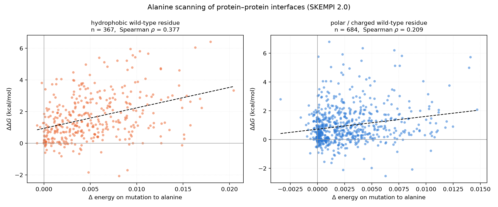
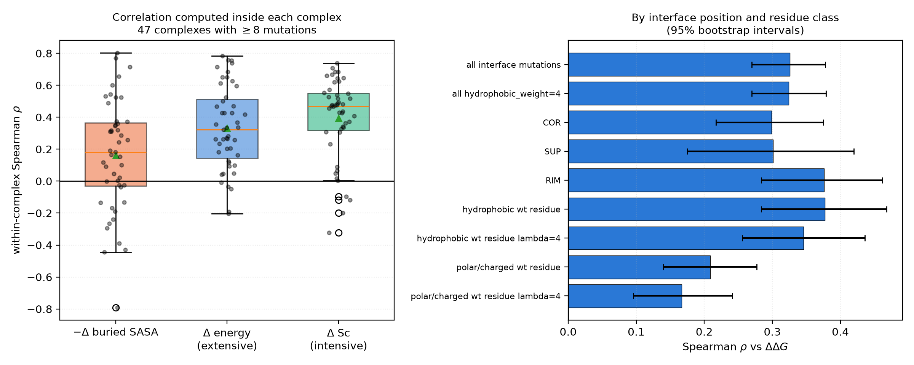

# ShapeComplementarityEnergy vs interface mutation effects (SKEMPI 2.0)

**Headline: within a single target the term works. It tracks the effect of interface mutations with
Spearman rho = 0.33 over 1051 mutations (p = 2e-27), and it significantly beats a buried-surface-area
baseline. This is the regime BAGEL actually samples in, and it is the opposite conclusion to the
cross-target affinity test in the parent directory.**

A second finding: the term does noticeably better where binding is mediated by hydrophobic residues
(rho = 0.38 vs 0.21 for polar/charged positions) — but **not** because of the `hydrophobic_weight`
parameter, which changes nothing measurable *on this dataset*.

> **That last clause turned out to matter.** An alanine scan cannot contain a single
> hydrophobic→polar substitution, because alanine is itself moderately hydrophobic on the scale the
> term uses. Tested on substitutions that do change hydrophobic character,
> [`hydrophobic_weight` has a large effect](hydrophobic_weight/summary.md): it lifts rho from 0.36 to
> 0.64 for mutations that remove a hydrophobic contact, and degrades it for mutations that add one.
> The null result below is real but applies only to alanine mutations.
>
> **Further refined in [`interface_environment/`](interface_environment/summary.md)**, which conditions
> on what the mutated residue actually touches across the interface. Restricting to hydrophobic
> pockets with no ionic involvement raises rho to 0.50 (0.72 with `hydrophobic_weight=4`) for
> mutations that remove hydrophobic contact — but no filtering rescues the case where hydrophobic
> contact is added.
>
> **Extended in [`repacked_nonalanine/`](repacked_nonalanine/summary.md)**, which tests general
> substitutions with an explicit side chain rebuild and repack. Two results there qualify this page:
> the hydrophobic/polar gap is far wider than it looks here (rho 0.45 vs 0.07 — the polar signal
> vanishes entirely for non-alanine substitutions), and the repacking caveat below turned out to
> point the wrong way: rebuilding and locally minimising the mutant made the correlation *worse*,
> not better.

## Why this test rather than the cross-target one

The [parent study](../summary.md) asked the term to rank 20 *different* target–binder pairs by
affinity. It could not, and it turned out to be a near-perfect proxy for interface size. But that is
not what a design run does: Monte Carlo mutates a sequence against one fixed target and compares the
result with the previous state on the *same* interface. This study asks that question instead.

## Data

SKEMPI 2.0, the curated benchmark of binding free-energy changes on mutation.

- Source: <https://life.bsc.es/pid/skempi2/> (`skempi_v2.csv` plus the distributed cleaned structures)
- Reference: Jankauskaitė, Jiménez-García, Dapkūnas, Fernández-Recio and Moal,
  *Bioinformatics* **35**, 462–469 (2019).

### Filtering, fixed in advance

From 7085 records: single mutations (5112) → mutations to alanine (2961) → wild type not Ala/Gly
(2880) → residue at the interface, SKEMPI class COR/SUP/RIM (2129) → not antibody/antigen or
TCR/pMHC (1457) → usable Kd for both wild type and mutant plus a temperature (1413) → |ΔΔG| < 10
kcal/mol (1411). Repeat measurements of the same mutation from different papers were averaged,
leaving **1051 unique mutations across 122 complexes**.

ΔΔG = RT ln(Kd_mut / Kd_wt), so a **positive ΔΔG means the mutation weakened binding**.

Mutation numbering was taken from `Mutation(s)_cleaned`, which matches the distributed structures;
1006 of the 1411 records differ from the original PDB numbering, and using the wrong column silently
mis-identifies the mutated residue. Every mutation was checked against the residue actually present
in the structure and all 1411 matched.

## Method

Only mutations to alanine were used, because for that class the mutant can be modelled exactly by
deletion: alanine's atoms (N, CA, C, O, CB) are a strict subset of the wild-type residue's. The
mutant structure is the wild-type structure with every side chain atom beyond CB removed at that
position. **No repacking and no relaxation** is performed — see the caveats.

ΔE = E(mutant) − E(wild type), so a **positive ΔE means the term thinks the mutation is worse**, and
a predictive term gives a **positive** Spearman rho against ΔΔG.

## Result

| subset                                    | n    | Spearman rho | p                      | CI low | CI high |
|-------------------------------------------|------|--------------|------------------------|--------|---------|
| all interface mutations, energy           | 1051 | 0.326        | 1.7000000000000002e-27 | 0.27   | 0.378   |
| all, energy hydrophobic_weight=4          | 1051 | 0.324        | 3.9e-27                | 0.27   | 0.379   |
| all, -delta buried SASA (baseline)        | 1051 | 0.178        | 5.8e-09                | 0.12   | 0.238   |
| all, delta Sc (intensive)                 | 1051 | 0.357        | 6.1e-33                | 0.301  | 0.412   |
| COR only, energy                          | 513  | 0.299        | 4.4e-12                | 0.217  | 0.375   |
| SUP only, energy                          | 223  | 0.301        | 4.7e-06                | 0.175  | 0.42    |
| RIM only, energy                          | 315  | 0.376        | 5.2e-12                | 0.284  | 0.462   |
| hydrophobic wt residue, energy            | 367  | 0.377        | 8e-14                  | 0.284  | 0.468   |
| hydrophobic wt residue, energy lambda=4   | 367  | 0.346        | 9.6e-12                | 0.256  | 0.436   |
| hydrophobic wt residue, -delta BSA        | 367  | 0.24         | 3.2e-06                | 0.142  | 0.335   |
| polar/charged wt residue, energy          | 684  | 0.209        | 3.5e-08                | 0.14   | 0.277   |
| polar/charged wt residue, energy lambda=4 | 684  | 0.167        | 1.1e-05                | 0.096  | 0.241   |
| polar/charged wt residue, -delta BSA      | 684  | 0.105        | 0.0059                 | 0.032  | 0.175   |

### 1. The term tracks mutation effects, and beats the area baseline

Over all 1051 mutations, rho = **0.326** (p = 1.7e-27, 95% CI [0.270, 0.378]) against **0.178** for
the change in buried SASA. A paired bootstrap on the same mutations gives a difference of
**+0.148, 95% CI [+0.113, +0.183]** — the term carries information that interface area does not.

Its collinearity with buried area is also far lower here than in the cross-target test:
rho(ΔE, −ΔBSA) = 0.84, against −0.99 across targets. Within a target, the geometry matters
independently of the size.

### 2. It holds up inside individual complexes

Removing every complex-level offset by correlating only within each complex that has at least 8
mutations (47 complexes, 825 mutations):

| predictor | median within-complex rho | positive in | Wilcoxon p |
|---|---|---|---|
| Δ energy (extensive) | **+0.323** | 42 / 47 | 8.2e-11 |
| Δ Sc (intensive) | **+0.470** | 43 / 47 | 1.9e-08 |
| −Δ buried SASA | +0.182 | 32 / 47 | 0.0034 |

### 3. Hydrophobic positions are where it works best

| wild-type residue | n | rho (energy) | rho (−ΔBSA) | mean ΔΔG |
|---|---|---|---|---|
| hydrophobic (AVILMFWCY) | 367 | **0.377** | 0.240 | 1.61 kcal/mol |
| polar / charged | 684 | 0.209 | 0.105 | 0.96 kcal/mol |

This is the expected behaviour for a geometric packing term: hydrophobic interface residues are the
classic hotspots, they are buried more deeply, and removing them opens a real void. Polar and charged
positions contribute through hydrogen bonds and salt bridges, which this term does not represent.

### 4. The `hydrophobic_weight` parameter does nothing *for alanine mutations*

Setting `hydrophobic_weight=4` changes rho from 0.326 to 0.324 overall, and on hydrophobic positions
it makes things slightly *worse* (0.377 → 0.346). Paired bootstrap: **−0.002, 95% CI
[−0.025, +0.019]** — indistinguishable from no change.

So on this dataset the term's advantage at hydrophobic positions comes from the geometry, not from
the chemistry weighting. **But see [`hydrophobic_weight/`](hydrophobic_weight/summary.md): this
dataset cannot test the parameter properly, because every mutation here is to alanine and therefore
none of them removes hydrophobic character. On substitutions that do, the parameter has a large and
significant effect.** It should still default to 1.0, because its benefit and its harm are equal and
opposite over a mixed mutation set.

### 5. The intensive statistic is at least as good for ranking mutations

Δ Sc gives rho = 0.357 overall and a within-complex median of 0.470, nominally the best of the three.
Against the extensive energy the paired difference is +0.031, 95% CI [−0.019, +0.079] — not
significant. This does not argue for changing the default: extensivity is what prevents a design from
improving its score by shedding a badly packed region, and what makes the term additive over an
interface. But if the only goal were ranking point mutations, the intensive form would do just as well.

## What this licenses

**Supported:** using the term inside a design run against a fixed target, to rank sequences by how
well they pack against that target. That is BAGEL's use case, and rho ≈ 0.33 within-target
(≈ 0.47 for the shape statistic) is a usable signal for Monte Carlo, which needs a ranking rather
than a calibrated number.

**Still not supported:** quoting the value as a ΔΔG or ΔG estimate, or comparing across different
targets. rho ≈ 0.33 means the term explains roughly a tenth of the rank variance; it is a useful
contributor to an energy function, not a predictor on its own.

## Caveats

- **The mutant is modelled by truncation, with no repacking or relaxation.** Real alanine mutants let
  the partner and neighbouring side chains collapse into the space vacated, which recovers some of
  the lost contact, so ΔE systematically overestimates the void created.
  *Update:* this caveat originally claimed the numbers were "a lower bound on what the term could
  achieve with a repacking step". [That was tested and is false](repacked_nonalanine/summary.md) —
  rebuilding and locally minimising the same 199 mutants gave rho = 0.253 against 0.326 for
  truncation (paired difference −0.073, 95% CI [−0.147, −0.001]). A rotamer-library repack might
  still help; a restrained minimisation does not.
- **Only X→Ala mutations were tested here.** Deletions are the easy direction.
  [The extension](repacked_nonalanine/summary.md) covers 297 general substitutions and finds the term
  does work when bulk is added (rho = 0.20) but more weakly than for deletions.
- ΔΔG values are pooled across heterogeneous assays (SPR, ITC, stopped-flow) and temperatures.
- Wild-type crystal structures only, so no conformational strain or entropy in either the data or the
  term.
- 47 complexes drive the within-complex analysis; the per-complex rho values are individually noisy
  (see `results_per_complex.csv`), and 5 of 47 are negative.

## Files

- `results_per_mutation.csv` — 1051 mutations with ΔΔG, ΔE at two weights, ΔSc, ΔBSA and provenance
- `results_per_complex.csv` — within-complex Spearman rho for each of the 47 complexes
- `correlations.csv` — all subsets with bootstrap intervals
- `plots/ddG_vs_denergy.png` — ΔΔG against ΔE, split by wild-type residue class
- `plots/within_complex_and_strata.png` — within-complex distributions and the subset breakdown

The sequences of the complexes used are regenerated by the scoring pipeline and are not committed to
the repository.

## Best and worst complexes

| PDB  | n mutations | rho energy | rho dSc | rho -dBSA |
|------|-------------|------------|---------|-----------|
| 3EQY | 9           | 0.783      | 0.517   | 0.77      |
| 1F47 | 10          | 0.758      | 0.624   | 0.345     |
| 1CBW | 8           | 0.755      | -0.096  | 0.802     |
| 4HFK | 8           | 0.738      | 0.738   | 0.524     |
| 1CHO | 8           | 0.714      | 0.048   | 0.714     |
| 3EQS | 9           | 0.683      | 0.683   | 0.544     |
| 1LFD | 18          | 0.651      | 0.552   | 0.531     |
| 1EMV | 32          | 0.65       | 0.527   | 0.488     |
| 1KTZ | 14          | 0.626      | 0.231   | 0.6       |
| 1Z7X | 15          | 0.613      | 0.466   | 0.654     |
| 1R0R | 8           | 0.595      | 0.619   | 0.31      |
| 1PPF | 8           | 0.524      | 0.667   | 0.31      |
