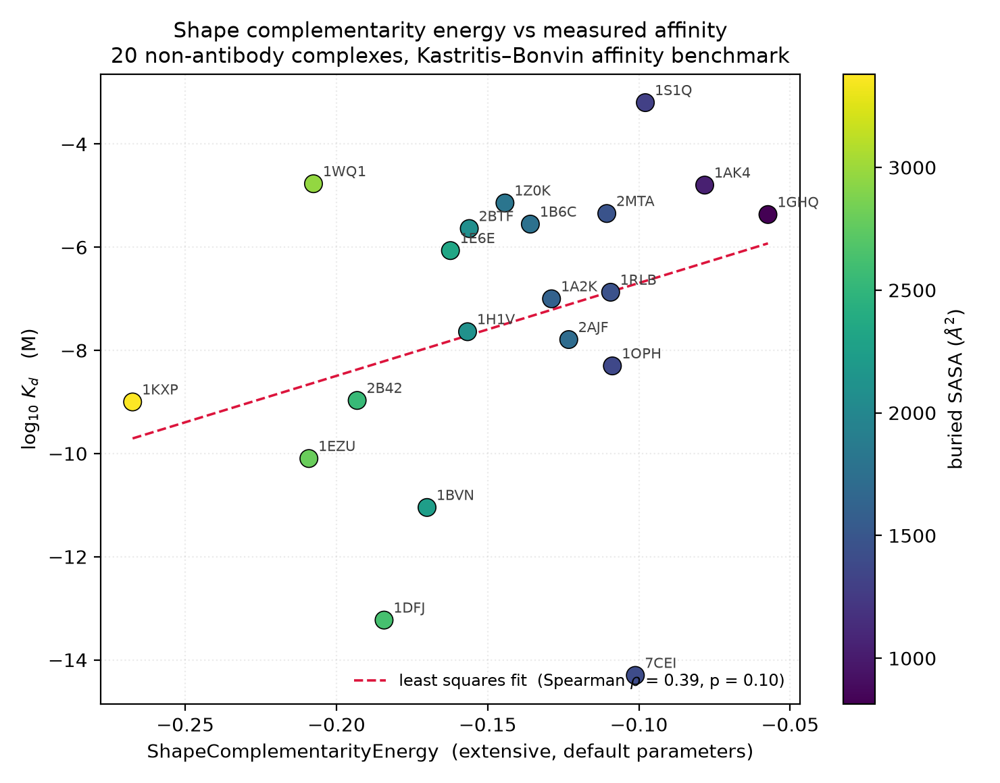
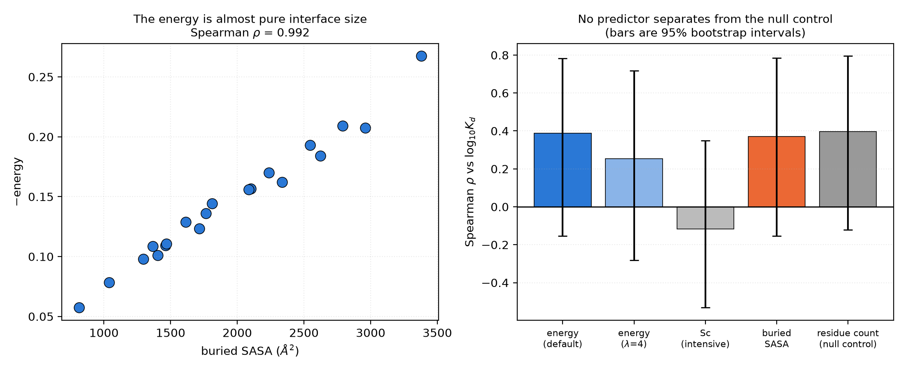

# ShapeComplementarityEnergy vs measured binding affinity

**Headline: the term does not predict binding affinity across different target–binder pairs, and it
does not beat counting residues. It should not be used or advertised as an affinity predictor.**

> **Read this alongside [`mutation_scan_skempi/`](mutation_scan_skempi/summary.md).** That second
> study asks the *within-target* question instead — does the term track the effect of mutating an
> interface residue, on 1051 alanine mutations from SKEMPI 2.0 — and the answer there is yes,
> rho = 0.33 (p = 2e-27), significantly better than a buried-area baseline. The two results are not
> in conflict: ranking different complexes against each other and ranking sequences against one
> fixed target are different problems, and only the second is what BAGEL does. The conclusion below
> is specifically about cross-target ranking.

## What was tested

`bagel.energies.ShapeComplementarityEnergy` was evaluated on 20 non-antibody protein–protein
complexes that have both a crystal structure and a measured dissociation constant, to see whether
the energy it assigns tracks the experimental affinity.

## Data

Affinities and chain assignments come from the curated Kastritis–Bonvin protein–protein binding
affinity benchmark (the 46-entry corrected version, in which only affinities judged fully accurate
are retained).

- Source: <https://github.com/haddocking/binding-affinity-benchmark> (`protein_protein_affinity_benchmark.csv`)
- Primary reference: P. Kastritis and A.M.J.J. Bonvin, *J. Proteome Research* **9**, 2216–2225 (2010),
  plus the published correction; see also Vreven *et al.*, *J. Mol. Biol.* **427**, 3031–3041 (2015).
- Structures: RCSB PDB, downloaded as deposited coordinates.

### Selection, fixed before any energy was computed

1. Drop every antibody/immune-receptor complex: benchmark `type` starting with `A`, plus any entry
   whose protein names match Fab, antibody, VHH, nanobody, scFv, immunoglobulin, TCR or MHC.
   Nine entries removed: 1AKJ, 1BJ1, 1E6J, 1IQD, 1JPS, 1KXQ, 2FD6, 2I25, 2JEL. 37 remained.
2. Rank the 37 by pKd and take 20 evenly spaced across the range, to span as much of the affinity
   range as possible without choosing by eye.
3. 1R0R was dropped because the benchmark lists chains A/C while the deposited structure uses E/I;
   the next unused entry (1DFJ) was substituted.

Every chain assignment used was then validated against the benchmark's own per-chain sequences.
All 20 matched to within 25% in length; no other mismatches were found.

The resulting set spans **11 orders of magnitude in Kd**, from 5 fM (7CEI, colicin E7 / Im7) to
0.64 mM (1S1Q, UEV domain / ubiquitin).

## Method

For each complex: first model, protein atoms only, hydrogens and non-standard residues removed, and
only the two chain groups named in the benchmark retained. Residue objects were built from the
structure's own `res_id` values so the interface masks line up with the deposited numbering.
The energy was computed with default parameters (`scaling='extensive'`, `hydrophobic_weight=1.0`).

Sign convention: a good binder has a **low (negative) energy** and a **low log10(Kd)**, so a
predictive term gives a **positive** Spearman rho.

## Result

Spearman rho against log10(Kd), with 95% bootstrap intervals (20,000 resamples) and permutation
p-values (20,000 shuffles):

| predictor                                         | spearman_rho | p_asymptotic | p_permutation | ci95_low | ci95_high |
|---------------------------------------------------|--------------|--------------|---------------|----------|-----------|
| ShapeComplementarityEnergy (default, extensive)   | 0.388        | 0.091        | 0.0951        | -0.155   | 0.783     |
| ShapeComplementarityEnergy (hydrophobic_weight=4) | 0.254        | 0.2796       | 0.2797        | -0.282   | 0.717     |
| Sc statistic (intensive)                          | -0.116       | 0.6269       | 0.6278        | -0.532   | 0.35      |
| Buried SASA (classic baseline)                    | 0.37         | 0.1084       | 0.1091        | -0.154   | 0.785     |
| Total residue count (null control)                | 0.397        | 0.0831       | 0.0854        | -0.121   | 0.795     |

### What this says

1. **The correlation is in the right direction but is not significant.** rho = 0.39, permutation
   p = 0.10, and the 95% interval [-0.16, 0.78] comfortably contains zero. The five strongest
   binders average an energy of -0.186 against -0.128 for the five weakest, so there is a hint of
   signal, but at n = 20 it is not distinguishable from noise.

2. **The energy is very nearly a restatement of interface size.** rho(energy, buried SASA) = **-0.992**
   (negative only because the energy is negative). Whatever the term measures, it is almost entirely
   how much surface is buried.

3. **It does not beat trivial baselines.** Buried SASA alone gives rho = 0.37, and simply counting
   the residues in the two chains gives rho = 0.40 — slightly *better* than the energy. Controlling
   for buried SASA, the partial correlation of the energy with log10(Kd) falls to 0.18 (p = 0.44):
   no independent signal.

4. **The shape-quality part on its own carries nothing.** The intensive Sc statistic, which removes
   interface size and keeps only the quality of fit, gives rho = -0.12 — indistinguishable from zero
   and nominally the wrong sign.

5. **Hydrophobic weighting makes it worse.** `hydrophobic_weight=4` drops rho from 0.39 to 0.25.

### Why this is unsurprising

This is the same conclusion the benchmark's authors reached: Kastritis and Bonvin tested nine widely
used docking scoring functions on this set and found sqrt(R) < 0.3 for all of them. Cross-target
affinity prediction from a single structure is simply not solved, and a purely geometric term has no
mechanism to solve it.

Two complexes show the problem directly:

- **7CEI** (colicin E7 / Im7) is the tightest binder in the set at 5 fM, yet buries only 1400 Ų, one
  of the smallest interfaces. Its affinity comes from electrostatic complementarity, which this term
  contains no representation of at all.
- **1WQ1** (Ras / RasGAP) is among the weakest at 17 µM despite burying 2960 Ų, the second largest
  interface. It is a transient catalytic complex that is *not supposed* to bind tightly.

No shape-and-size term can order those two correctly.

## What this does and does not license

**Not supported:** using this term to rank different target–binder pairs by expected affinity, or
reporting its value as a proxy for Kd.

**Supported, and since tested directly:** using it as a geometric term within a design run against a
*single fixed target*, where the comparison is between sequences on the same interface rather than
across systems. The companion study in [`mutation_scan_skempi/`](mutation_scan_skempi/summary.md)
tests exactly this on 1051 interface alanine mutations and finds rho = 0.33 overall, a within-complex
median of 0.32, and a significant margin over a buried-area baseline (+0.148, 95% CI [+0.113,
+0.183]). The term is most informative at hydrophobic interface positions (rho = 0.38 against 0.21 at
polar/charged ones).

**Recommendation for the PR:** keep the term, and state plainly in its documentation that

- it ranks packing quality *within* a target and is not an affinity predictor across targets;
- its signal lives at **hydrophobic** interface positions (rho ≈ 0.45), and it carries no measurable
  information at polar or charged ones (rho ≈ 0.07) — see
  [`mutation_scan_skempi/repacked_nonalanine/`](mutation_scan_skempi/repacked_nonalanine/summary.md);
- `hydrophobic_weight` should stay at its default of 1.0 — but *not* because it is inert. It helps
  markedly for mutations that remove a hydrophobic contact (rho 0.36 to 0.64) and hurts for those that
  add one, and the two cancel over a mixed set. See
  [`mutation_scan_skempi/hydrophobic_weight/`](mutation_scan_skempi/hydrophobic_weight/summary.md).

## Caveats

- n = 20 is small; all confidence intervals are wide and this study can only exclude a strong effect,
  not a modest one.
- Kd values come from heterogeneous assays (SPR, ITC, stopped-flow, spectroscopy) at differing pH and
  temperature. The `method` column in `results_per_complex.csv` records the original assay class.
- Energies are computed on bound crystal structures, so conformational strain and the entropic cost of
  binding are absent by construction — as they are from the term itself.
- The term has no electrostatics, no desolvation and no entropy, so this test asks it a question it
  was not built to answer. That is the point of running it.

## Files

- `results_per_complex.csv` — per-complex energies, affinities, interface sizes and provenance
- `correlations.csv` — Spearman rho, bootstrap intervals and permutation p-values for all predictors
- `partial_correlation.json` — partial correlation controlling for buried SASA
- `plots/logkd_vs_energy.png` — headline scatter, coloured by buried SASA
- `plots/energy_vs_size_and_predictor_comparison.png` — collinearity with size, predictor comparison

The per-complex target and binder sequences (as actually scored) are regenerated by the scoring
pipeline and are not committed to the repository.

## Per-complex results

| PDB  | target                    | binder                                     | chains T | chains B | Kd (M)  | log10 Kd | assay | energy  | Sc    | buried SASA |
|------|---------------------------|--------------------------------------------|----------|----------|---------|----------|-------|---------|-------|-------------|
| 7CEI | Colicin E7 nuclease       | Im7 immunity protein                       | A        | B        | 5e-15   | -14.3    | F     | -0.1012 | 0.478 | 1403        |
| 1DFJ | Ribonuclease A            | Rnase inhibitor                            | E        | I        | 5.9e-14 | -13.23   | B     | -0.1842 | 0.459 | 2623        |
| 1BVN | α-amylase                 | Tendamistat                                | P        | T        | 9e-12   | -11.05   | D     | -0.17   | 0.495 | 2238        |
| 1EZU | D102N Trypsin             | Y69F D70P Ecotin                           | C        | AB       | 8e-11   | -10.1    | E     | -0.2091 | 0.488 | 2789        |
| 1KXP | Actin                     | Vitamin D binding protein                  | A        | D        | 1e-09   | -9.0     | C     | -0.2674 | 0.508 | 3381        |
| 2B42 | Xylanase                  | Xylanase inhibitor                         | A        | B        | 1.1e-09 | -8.97    | D     | -0.1931 | 0.494 | 2545        |
| 1OPH | α-1-antitrypsin           | Trypsinogen                                | A        | B        | 5e-09   | -8.3     | A     | -0.1088 | 0.513 | 1366        |
| 2AJF | ACE2                      | SARS spike protein receptor binding domain | A        | E        | 1.6e-08 | -7.79    | D     | -0.1232 | 0.468 | 1714        |
| 1H1V | Actin                     | Gelsonin                                   | A        | G        | 2.3e-08 | -7.64    | B     | -0.1567 | 0.495 | 2103        |
| 1A2K | Ran GTPase                | Nuclear Transport Factor 2                 | C        | AB       | 1e-07   | -7.0     | F     | -0.1289 | 0.52  | 1615        |
| 1RLB | Transthyretin             | Retinol binding protein                    | ABCD     | E        | 1.3e-07 | -6.87    | A     | -0.1093 | 0.48  | 1463        |
| 1E6E | Adrenoxin reductase       | Adrenoxin                                  | A        | B        | 8.6e-07 | -6.07    | D     | -0.1623 | 0.457 | 2336        |
| 2BTF | Actin                     | Profilin                                   | A        | P        | 2.3e-06 | -5.64    | A     | -0.1561 | 0.5   | 2086        |
| 1B6C | FKBP Binding Protein      | TGFβ receptor                              | A        | B        | 2.8e-06 | -5.55    | D     | -0.1359 | 0.497 | 1764        |
| 1GHQ | Complement C3             | Epstein-Barr virus receptor CR2            | A        | B        | 4.3e-06 | -5.37    | D     | -0.0573 | 0.458 | 813         |
| 2MTA | Methylamine Dehydrogenase | Amicyanin                                  | HL       | A        | 4.5e-06 | -5.35    | G     | -0.1106 | 0.477 | 1468        |
| 1Z0K | Rab4A GTPase              | RAB4 binding domain of Rabenosyn           | A        | B        | 7.2e-06 | -5.14    | D     | -0.1443 | 0.519 | 1812        |
| 1AK4 | Cyclophilin               | HIV capsid                                 | A        | D        | 1.6e-05 | -4.8     | F     | -0.0782 | 0.492 | 1040        |
| 1WQ1 | Ras GTPase                | Ras GAP                                    | R        | G        | 1.7e-05 | -4.77    | B     | -0.2076 | 0.452 | 2960        |
| 1S1Q | UEV domain                | Ubiquitin                                  | A        | B        | 0.00064 | -3.2     | D     | -0.0979 | 0.485 | 1296        |
